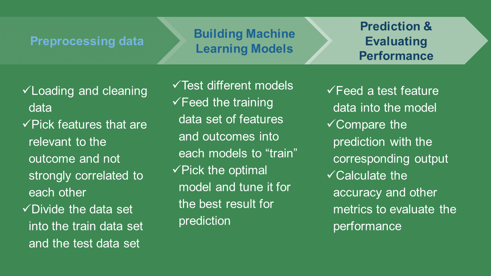
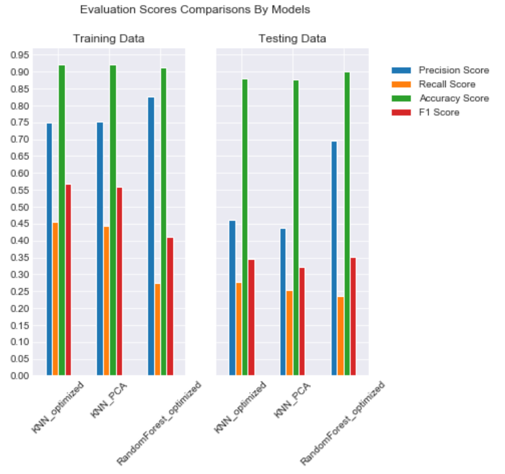
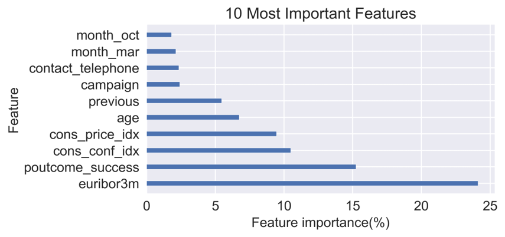

# Predictive modeling for a bank marketing data set using machine learning algorithms 

## About the project 
This project uses a data set from [here](http://archive.ics.uci.edu/ml/datasets/Bank+Marketing#). 

The types of information given are 20 features:

* Personal information ex) job, age, marital status, education, 

* Financial information ex) Default credit, owning a housing, having a personal loan

* Information about if the bank contacted the client for the previous campaign or for the current campaign ex) frequency and total number of time contacted, contact type

* Economic situation at the time of the campaign ex) with different metrics representing employment rate, inflation, consumer optimism, average interest rate

The goal of this project is to answer the following question:

**
Can we predict if a client is going to subscribe a term deposit using the information collected about the client?**

Moreover, not only predicting 'yes' or 'no' to the question above, we want to know which factors are more influential to decide the prediction.   

### Models used in this project
In order to predict the target, three machine learning algorithms are implemented: 
principal component analysis (PCA), K nearest neighbors (KNN), and Random Forest. 

### Modeling process
The following diagram summarize the modeling process for this project. 

In the process of building machine learning models, three machine learning algorithms are implemented: 
principal component analysis (PCA), K nearest neighbors (KNN), and Random Forest. 

* As the PCA is getting new features by combining the features we have for better prediction, it was combined with the KNN; the KNN was implemented using the new features created from the PCA. 

* the KNN, the Random Forest, the KNN with the PCA models were tuned using their hyperparameters for optimal results for the data. 

### Modeling results
By comparing the 4 evaluation scores, the performances of the three models
were compared. 

The random forest model performed the best in accuracy, precision, and F-1 scores for predicting testing dataset. 

Moreover,the random forest model provides the feature importance which 
is to calculate the ratio in percentage that influence the decision of the outcome.

The top 10 most important features are plotted in the graph above.
The + and - signs indicate the positive and negative correlation with the target variable. 
* The most influential category was for economical and social situations:
    * Euribor3m(-): The 3 month maturity Euribor interest rate is the interest rate at which a selection of European banks lend one another funds denominated in euros whereby the loans have a maturity of 3 months. 
    * cons_conf_idx(+): consumer confidence which represent how optimistic consumers are for the economy based on the average shopping pattern
    * Cons_price_idx(-): consumer price index which reflects the inflation

* The second category is for Previous experience
    * poutcome_success(+): successful outcome of previous campaign
    * previous(+): number of contact performed before this campaign
    * campaign(-): number of contacts performed during this campaign 

* Only one personal information category made to top is Age group
    * age(+)

* Further more, Communication type between cellphone and telephone mattered.  
    * contact_telephone(-): telephone instead of cell phone

* Finally the timing of the campaign influenced too. 
    * month_mar(+)
    * month_oct(+)

### Limitations and Future Direction

Now what do we do with this model?

First we should keep in mind that **the model predictions and feature importance should be used as clues not as the whole picture.** This model uses the technique solely focused on how to get the output correctly although the results could be related for applications. Therefore it should be combined with other knowledge such as marketing to make our findings more concrete. 

Second, we can **combine business ideas and feature importance to develop a plan to increase the success rate.** 
For example,
* methods and frequency of contacting clients
    * how often should the bank contact a client for a successful campaign.

* Maintaining the connection with current/perspective clients are important. 

* Campaign targeting timing and specific age groups
    * plan a campaign to target specific time of the year or specific age group may be recommended. 

Third, for the technical perspectives:
* different types of models such as the gradient boosting or the logistic regression that can provide the feature importance can be implemented to compare with the results that we have. 

## How to use the codes (`codes.ipynb`)
### List of libraries to be imported
The jupyter notebook contains **importing libraries** section at the very beginning. You should have all of them installed to run the codes in it. 

### Pickled dictionaries
In **Save and load results** section of the notebook, you can import the dictionary that contains the prepared data and modeling results from `result.pickle`. Since the model results are organized using the class `result`, it should be run before loading the pickle file. Please refer to the section for more explanation.

## Non-technical summary of the project
The non-technical summary of the project is saved as `NonTechPresentation.pdf`.
